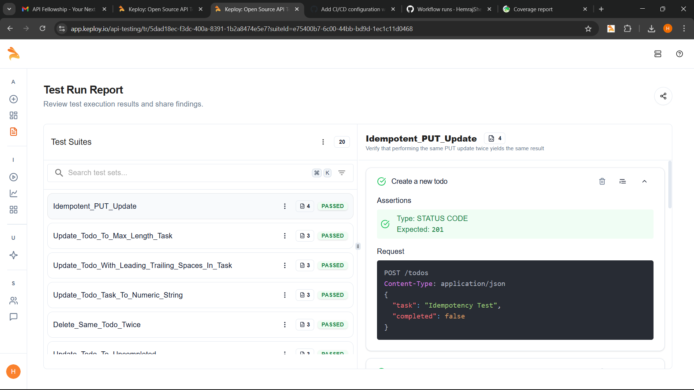

# Todo API

A full-stack Todo List application with a Flask backend and modern frontend, featuring comprehensive testing and CI/CD integration.

## Features

- **Backend (Flask + SQLite)**
  - RESTful API with CRUD operations
  - SQLite database for data persistence
  - Comprehensive error handling
  - Health check endpoint
  - Detailed logging

- **Frontend**
  - Clean and responsive UI
  - Real-time updates
  - Error handling and user feedback
  - Modern CSS styling

- **Testing**
  - Unit tests with pytest
  - Integration tests
  - API tests with comprehensive coverage
  - Smoke tests
  - Test result reporting

### API Test Results



## API Endpoints

| Method | Endpoint | Description |
|--------|----------|-------------|
| GET | `/todos` | List all todos |
| POST | `/todos` | Create a new todo |
| GET | `/todos/{id}` | Get a specific todo |
| PUT | `/todos/{id}` | Update a todo |
| DELETE | `/todos/{id}` | Delete a todo |
| GET | `/health` | Health check endpoint |

## Project Structure

```
todo-api/
├── backend/
│   ├── app.py              # Flask application
│   ├── requirements.txt    # Python dependencies
│   └── tests/             # Test files
├── frontend/
│   ├── index.html         # Main HTML file
│   ├── style.css          # Styles
│   └── script.js          # Frontend logic
├── .github/
│   └── workflows/         # GitHub Actions workflows
├── assets/
│   ├── API_test.png       # API test results
│   └── coverage.png       # Coverage report
└── docker/
    ├── Dockerfile         # Production container
    └── docker-compose.yml # Development setup
```

## Getting Started

1. **Clone the Repository**
   ```bash
   git clone https://github.com/HemrajShelke/todo-api.git
   cd todo-api
   ```

2. **Set Up Backend**
   ```bash
   cd backend
   python -m venv venv
   source venv/bin/activate  # On Windows: venv\Scripts\activate
   pip install -r requirements.txt
   ```

3. **Run the Application**
   ```bash
   python app.py
   ```

4. **Run Tests**
   ```bash
   # Run all tests
   pytest tests/

   # Run API tests
   python test_api_with_keploy.py
   ```

## Development

- **Backend Development**
  ```bash
  cd backend
  flask run --debug
  ```

- **Run Tests with Coverage**
  ```bash
  pytest --cov=. tests/
  ```

## CI/CD Pipelines

The project includes three GitHub Actions workflows:

1. **CI/CD Pipeline** (`ci-cd.yml`)
   - Builds and tests the application
   - Runs integration tests
   - Deploys to production (on main branch)

2. **API Testing** (`api-test.yml`)
   - Runs comprehensive API tests
   - Generates test reports
   - Collects test artifacts

3. **Keploy Testing** (`keploy.yml`)
   - Runs Keploy-specific tests
   - Records API interactions
   - Validates against recorded tests

## Contributing

1. Fork the repository
2. Create a feature branch
3. Commit your changes
4. Push to the branch
5. Create a Pull Request

## License

This project is licensed under the MIT License - see the LICENSE file for details.
